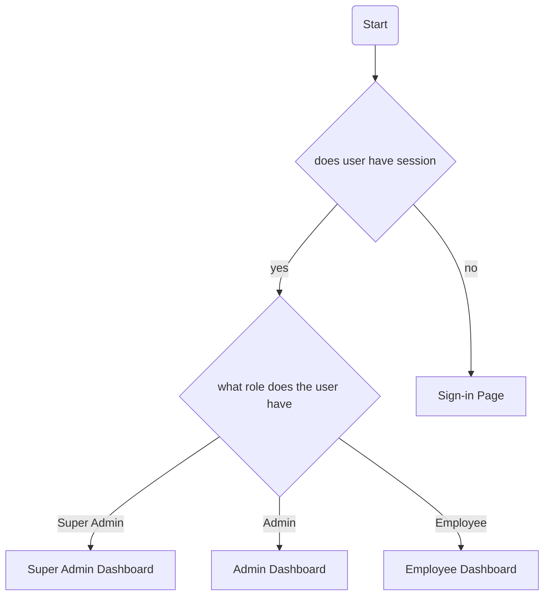

# Employee Claims System
## Launching App
1. Start local containers: ```supabase start```
2. Run app: ```npm run dev```
3. Dashboard URL: ```localhost:54323```

## User Logins
- Super Admin
  email: superadmin@ecs.com
  password: superadmin

- Admin #1
  email: admin-01@ecs.com
  password: justadmin

- Employee #1
  email: employee-01@ecs.com
  password: employee01

## Database Commands
### Update local DB from remote
1. Login CLI: ```supabase login```
2. If project needs to be linked: ```supabase link```
3. Pull changes into a migration file: ```supabase db pull```
4. Implement migration: ```supabase db reset```

### Push local DB to remote
1. Steps 1 and 2 from above
2. supabase db push

### Dump data from local into seed.sql
- ```supabase db dump --local -f 'supabase/seed.sql --data-only```

## Site Map


## Notes
App is currently set in its .env.local to point to the local API. Values are taken from the output from running ```supabase start```.
